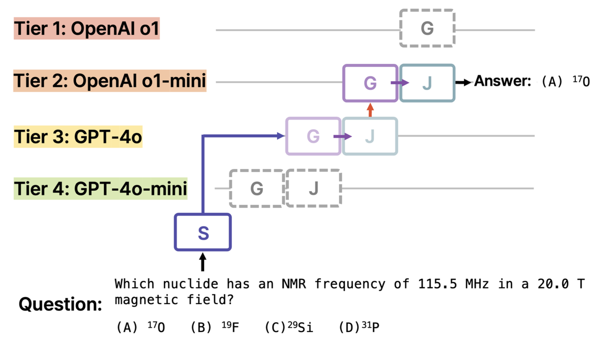

# Automatic Transmission for LLM Tiers: Optimizing Cost and Accuracy in Large Language Models


This repository is the official implementation of ACL 2025 findings paper: [Automatic Transmission for LLM Tiers: Optimizing Cost and Accuracy in Large Language Models](https://arxiv.org/abs/2505.20921).


## Overview


Recent LLM services offer multiple tiers of models with varying performance and cost, making it a key challenge to select the most suitable model for each subtask in complex and modularized NLP workflows. To this, **LLM-AT** is a **training-free LLM routing framework** that automatically selects the appropriate tier among models with varying performance and cost, effectively balancing accuracy and efficiency.

LLM-AT operates with the following components:

- **Starter (S):** Selects the appropriate initial tier for the question.
- **Generator (G):** Generates a response using the LLM of the selected tier.
- **Judge (J):** Evaluates the validity of the generator’s response using the same tier.

If the response is invalid, LLM-AT upgrades to a higher tier and repeats generation and evaluation until a valid response is obtained or the top tier is reached.

<p align="center">
  
</p>


## Requirements


```
pip install langchain_chroma
pip install langchain_community
```

To use OpenAI models, set your API key in utils/model_util.py as follows:

```
os.environ['OPENAI_API_KEY'] = 'your-api-key-here'
```


## Datasets


- In our paper, we use two datasets, each comprising five levels of question difficulty.
- [**MATH**](https://arxiv.org/pdf/2103.03874): A set of math competition problems across five difficulty levels. 400 questions are sampled based on difficulty.
- **MCQA**: A multiple-choice QA set built from [OpenBookQA](https://arxiv.org/pdf/1809.02789v1), [ARC](https://arxiv.org/pdf/1803.05457v1)-Easy, ARC-Challenge, [MMLU](https://arxiv.org/pdf/2009.03300), and [GPQA](https://arxiv.org/pdf/2311.12022). A total of 1,500 questions are sampled according to the difficulty of each dataset.


## LLM-AT


We construct the LLM tier system using OpenAI models, ordered from lower to higher tiers as GPT-4o-mini, GPT-4o, o1-mini, and o1. Model performance and pricing follow as of January 17, 2025.

LLM-AT can be run in two modes: real-time inference and simulation mode, which simulates results based on precomputed outputs. The following arguments can be used in both modes:

### **Configurable Parameters**

- `--Tier_list` : Specify the list of tiers to use, ordered from lowest to highest, separated by commas. For example: gpt-4o-mini,gpt-4o,o1-mini,o1.
- `--top_k` : When estimating the initial tier, the top-k most similar past queries to the input are referenced.
- `--threshold` : The lowest tier whose estimated accuracy exceeds this threshold is selected as the initial tier.
- `--lambda_`: A hyperparameter that controls the influence of benchmark accuracy in the accuracy estimation. A larger λ value places more weight on the benchmark performance when estimating accuracy.
- `--acc_list`: The benchmark accuracy values for each LLM tier. These values are used as prior information during accuracy estimation, providing background knowledge about the performance of each LLM. For example: 0.572,0.679,0.699,0.803.
- `--base_path`: Base path for save the result.
- `--dataset_name` : Dataset name. MATH or MCQA.
- `--save`: Specify whether to save the final results.

### Running the LLM-AT Framework

Given an input query or dataset, the LLM-AT framework performs real-time tier selection, response generation, and validity evaluation.

```python
python LLM-AT_MATH.py --Tier_list gpt-4o-mini,gpt-4o,o1-mini,o1 --top_k 5 --threshold 0.7 --lambda_ 5.0 --acc_list 0.572,0.679,0.699,0.803 --base_path /your/path --dataset_name MATH --save True
```

```python
python LLM-AT_MCQA.py --Tier_list gpt-4o-mini,gpt-4o,o1-mini,o1 --top_k 5 --threshold 0.7 --lambda_ 5.0 --acc_list 0.572,0.679,0.699,0.803 --base_path /your/path --dataset_name MCQA --save True
```

### **Simulation Mode**

Simulates the LLM-AT routing process using precomputed responses, costs, and execution times for each tier, without performing actual inference.

```python
python MATH_simulation.py --Tier_list gpt-4o-mini,gpt-4o,o1-mini,o1 --top_k 5 --threshold 0.7 --lambda_ 5.0 --acc_list 0.572,0.679,0.699,0.803 --base_path /your/path --dataset_name MATH --save True
```

```python
python MCQA_simulation.py --Tier_list gpt-4o-mini,gpt-4o,o1-mini,o1 --top_k 5 --threshold 0.7 --lambda_ 5.0 --acc_list 0.572,0.679,0.699,0.803 --base_path /your/path --dataset_name MCQA --save True
```
